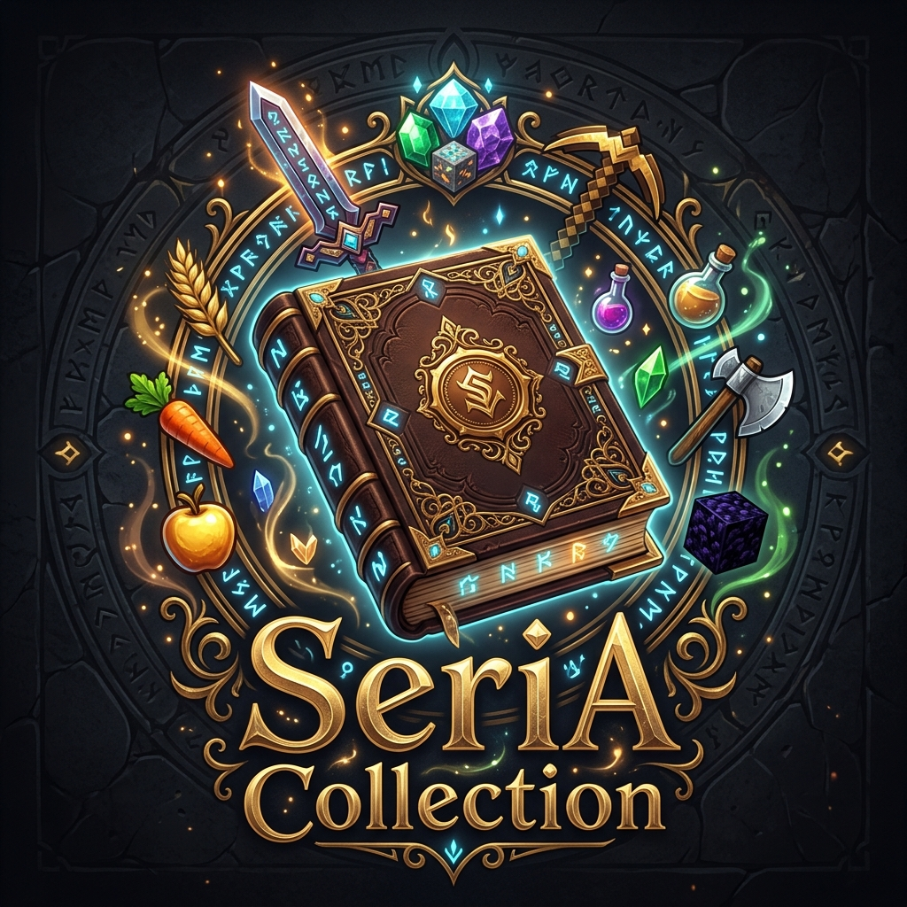

# SeriaCollection

## Overview
**SeriaCollection** is a Hypixel-style progressive collection system. Players gain collection points by gathering specific items, unlocking tiered rewards, crafting recipes, and permanent stat boosts.

## Features
- **Dynamic Tier System**: Define unlimited tiers for any item with custom requirements and rewards.
- **MMOItems Integration**: Supports custom items from MMOItems for collection tracking.
- **Interactive GUI**: Beautiful menus to track progress, view rewards, and see locked tiers.
- **Smart Tracking**: Automatically detects item types (including NBT-based custom items) to increment collection counts.
- **Recursive Rewards**: Unlock new crafting recipes or items directly through collection progression.

## Commands
- `/collect` (or `/collection`): Opens the collection overview menu.
- `/seriacollection` (or `/scollect`): Administrative commands (Reload, Give, Set).

## Developer Wiki
For placeholders, permission nodes, and full YAML configuration examples, visit the [Wiki](docs/WIKI.md).
